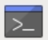

## Installeer het model op jouw Raspberry Pi

<html>
  <div style="position: relative; overflow: hidden; padding-top: 56.25%;">
    <iframe style="position: absolute; top: 0; left: 0; right: 0; width: 100%; height: 100%; border: none;" src="https://www.youtube.com/embed/p7rBtA08QWA?rel=0&cc_load_policy=1" allowfullscreen allow="accelerometer; autoplay; clipboard-write; encrypted-media; gyroscope; picture-in-picture; web-share">
    </iframe>
  </div>
</html>

\--- task ---

Om te beginnen moet je de terminal openen. Je kunt dit doen door op het terminalpictogram te klikken:



of door op <kbd>Ctrl</kbd> + <kbd>Alt</kbd> + <kbd>T</kbd>te drukken.

\--- /task ---

\--- task ---

Typ in het terminalvenster:

```bash
wget -qO- rpf.io/install-sd | bash
```

Druk op <kbd>, Enter</kbd> in en wacht tot het model is gedownload en geïnstalleerd. Dit kan even duren.

\--- /task ---

\--- task ---

Zodra de installatie is voltooid, verschijnt de terminalprompt opnieuw.

\--- /task ---
