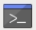

## Встанови модель на своєму компʼютері Raspberry Pi

<html>
  <div style="position: relative; overflow: hidden; padding-top: 56.25%;">
    <iframe style="position: absolute; top: 0; left: 0; right: 0; width: 100%; height: 100%; border: none;" src="https://www.youtube.com/embed/p7rBtA08QWA?rel=0&cc_load_policy=1" allowfullscreen allow="accelerometer; autoplay; clipboard-write; encrypted-media; gyroscope; picture-in-picture; web-share">
    </iframe>
  </div>
</html>

--- task ---

Для початку тобі потрібно відкрити термінал. Для цього натисни на значок терміналу:



або натисни <kbd>Ctrl</kbd> + <kbd>Alt</kbd> + англійська <kbd>T</kbd>.

--- /task ---

--- task ---

У вікно терміналу введи:

``` bash
wget -qO- rpf.io/install-sd | bash
```

Натисни <kbd>Enter</kbd> і зачекай, поки модель завантажиться і встановиться. Це може зайняти деякий час.

--- /task ---

--- task ---

Після завершення інсталяції знову з’явиться підказка терміналу.

--- /task ---
