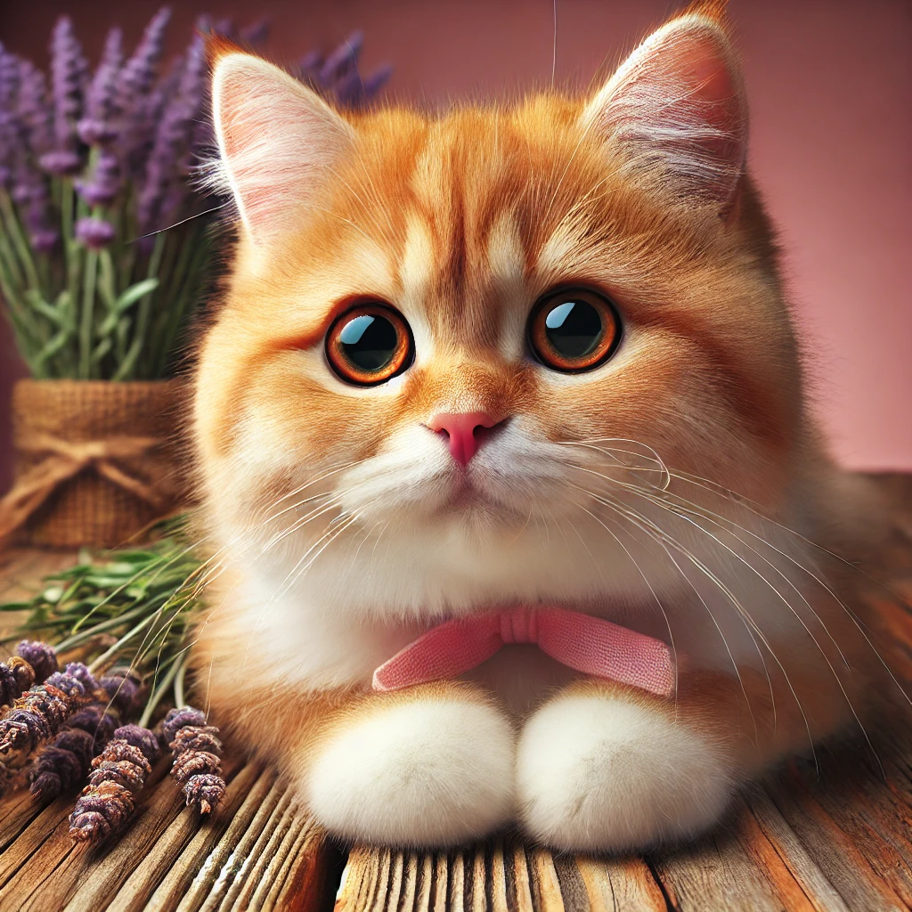

## Запусти скрипт

--- task ---

Введи в термінал наступну команду й натисни <kbd>Enter</kbd>, щоб запустити скрипт:

```bash
./run_sd.sh
```

--- /task ---

--- task ---

Термінал попросить тебе ввести запит (англійською мовою). Це опис зображення, яке ти хочеш згенерувати. Запит визначає процес генерування зображення, описуючи потрібну сцену чи предмет. Якщо ти хочеш дізнатися більше про генерування зображень за допомогою ШІ, [переглянь цей проєкт](https://projects.raspberrypi.org/uk-UA/projects/ai-image-prompt/){:target="_blank"}.

```bash
Enter the prompt: A cat
```

Натисни <kbd>Enter</kbd>.

--- /task ---

--- task ---

Далі введи кількість кроків. Від цього залежить якість зображення. Чим більше кроків, тим зазвичай вища якість зображень, оскільки модель має більше можливостей вдосконалити результат. На Raspberry Pi 5 із 4 ГБ оперативної пам’яті один крок виконується приблизно одну хвилину.

```bash
Enter the number of steps: 5
```

Натисни <kbd>Enter</kbd>.

--- /task ---

--- task ---

Введи назву файла зображення. Під цим іменем збережеться згенероване зображення.

```bash
Enter the output image file name: cat.png
```

Натисни <kbd>Enter</kbd>.

--- /task ---

--- task ---

Дочекайся, доки зображення згенерується.

Скрипт працює на основі введених тобою даних, щоб створити зображення. Це може зайняти кілька хвилин залежно від кількості кроків і потужності комп’ютера.

--- /task ---

--- task ---

Перевір результат.

Після завершення процесу згенероване зображення збережеться в поточній папці зі вказаною назвою файлу.



--- /task ---

З цими вказівками ти легко зможеш генерувати зображення за допомогою скрипту. Запит визначає, що буде зображено на картинці, кількість кроків впливає на її якість, а назва вказує, під яким іменем буде збережено файл.

А тепер створюй свої зображення!
